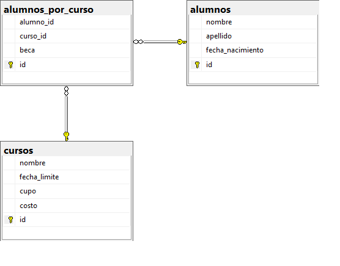

En este repo se encuentra el desarrollo para el enunciado del 2do parcial de Diseño y Arquitectura en la UAI del 27/11/2024, hecho por Lautaro Haase. Profesor: Jorge Roda

## Enunciado

## Demo

## Desarrollo

El proyecto se encuentra dividido en 4 capas:

### BE:
Esta capa contiene los modelos del negocio: Alumno y Curso

### BLL:
Esta capa contiene clases que saben manejar la lógica del negocio asociada a las entidades Alumno y Curso; respectivamente son las clases Alumnos y Cursos.
- Alumnos:
        Sabe mapear datos provistos por la GUI a instancias de BE.Alumno.
        Se encarga de interactuar con la DAL para crear, modificar, o eliminar alumnos en la BD.

- Cursos:
        Sabe mapear datos provistos por la GUI a instancias de BE.Curso.
        Se encarga de interactuar con la DAL para crear cursos en la BD.

### DAL:
Esta capa es la encargada de interactuar directamente con la BD. Provee métodos para abrir conexiones y abstracciones para ejecutar procedimientos o comandos, con o sin parámetros.

### GUI:
Es la interfaz grafica donde se definen los distintos formularios y controles personalizados.
    
## Base de datos

### Diagrama

En el [script.sql](script.sql) se puede ver el detalle de la base incluyendo los procedimientos. En [datos-de-prueba.sql](datos-de-prueba.sql) se pueden ver/crear datos de prueba.
